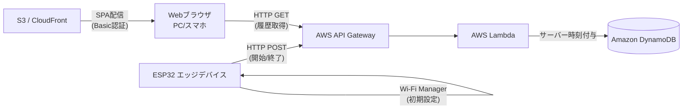

# ColorTimer Next 基本設計

本ドキュメントでは、ColorTimer Nextプロジェクトのシステム全体像、インターフェース、データ構造について定義します。

## 1. システムアーキテクチャ構成
### 1.1 全体構成図 (概念)


### 1.2 各コンポーネントの役割
* **エッジ側 (ESP32-WROOM-32)**
  * **設定管理**: `WiFiManager` により初回起動時にAPになりブラウザから設定を行う。また、デバイスの**ボタンを押したまま電源を入れる（リセットする）**ことで、すべての設定（Wi-Fi、API情報等）を消去して工場出荷状態に戻す機能を実装する。
  * **状態遷移とUI**: ボタン押下をトリガーに「開始」「終了」状態を切り替え、OLEDへの状態表示、色LEDの切り替え、ブザー鳴動を行う。
  * **通信**: ステータス変更時にクラウドへ HTTPリクエスト を送信。エラー時はOLEDにエラー通知を行う。

* **クラウド側 (AWS バックエンド)**
  * **API Gateway**: データの受信用とWebアプリからの取得用の口を用意し、エッジからのリクエストはAPIキーで保護する（REST API と API Key の構成）。
  * **Lambda**: エッジからのリクエストを受け取り、**受信時のサーバー時刻**を付与してDynamoDBへ保存する。また、Webアプリからの履歴取得要求に対してDynamoDBからデータを取得し返却する。
  * **DynamoDB**: 時系列データとして安価に永続化する。

* **フロントエンド (Webアプリ)**
  * **アーキテクチャ**: React等のSPA (Single Page Application) をS3に配置し、CloudFront経由で配信する。
  * **認証**: CloudFront Functionsを用いたBasic認証でページへのアクセスを保護。
  * **機能**: API Gateway経由でLambdaからデータを取得し、作業履歴一覧および統計（週次・月次等）を表示する。

---

## 2. インターフェース設計 (REST API)

### 2.1 データ受信用 API (ESP32 -> AWS)
* **Endpoint**: `POST /api/logs`
* **認証**: HTTP Header `x-api-key: <ESP32に設定したAPIキー>`
* **Request Body (JSON)**:
  ```json
  {
    "device_id": "esp32-timer-01",
    "action": "start"  // "start" または "end"
  }
  ```
* **Response**:
  * 成功時: `200 OK`
  * 失敗時: `400 Bad Request`, `403 Forbidden`, `500 Internal Server Error`

### 2.2 データ取得用 API (Web App -> AWS)
* **Endpoint**: `GET /api/logs?device_id={device_id}&start_date={YYYY-MM-DD}&end_date={YYYY-MM-DD}`
* **認証**: Webアプリ側のセッションや事前発行トークン（Basic認証環境下での簡易なもの）を想定。
* **Response Body (JSON)**:
  ```json
  [
    {
      "timestamp": "2026-03-04T10:00:00Z",
      "action": "start"
    },
    ...
  ]
  ```

---

## 3. データベース設計 (DynamoDB テーブル定義)

永続化や集計のしやすさを考慮し、ログテーブルを以下のように設計する。
無料枠(25WCU/25RCU)に収めるため、プロビジョニングモードでミニマム構成とする想定。

| 項目論理名 | 項目物理名  | データ型 | キー設定               | 説明                                                                                            |
| :--------- | :---------- | :------- | :--------------------- | :---------------------------------------------------------------------------------------------- |
| デバイスID | `DeviceId`  | String   | **Partition Key (PK)** | リクエスト送信元のデバイスの識別子                                                              |
| 送信日時   | `Timestamp` | String   | **Sort Key (SK)**      | ISO8601拡張形式（例: `2026-03-04T10:00:00.000Z`）。Lambdaで付与                                 |
| アクション | `Action`    | String   | -                      | "start" または "end"                                                                            |
| 実装予備   | `ExpireAt`  | Number   | (TTL属性)              | ※現状は未指定とし永続化する。DynamoDBの無料枠(25GB)は今回のログ流量では事実上無制限に近いため。 |

---

## 4. ハードウェア設計 (エッジデバイス)

本プロジェクトのエッジデバイスはメモリ・通信性能の安定性と将来の拡張性を考慮し、**ESP32-WROOM-32E** を採用します。

### 4.1 構成部品 (BOM)

| 部品名         | 仕様・想定パーツ                            | 数量 | 用途                                                       |
| :------------- | :------------------------------------------ | :--- | :--------------------------------------------------------- |
| MCUボード      | ESP32-WROOM-32E 開発ボード                  | 1    | メイン制御、Wi-Fi通信、HTTPSリクエスト通信                 |
| ディスプレイ   | 0.96インチ I2C OLED (SSD1306等)             | 1    | 各種状態や通信エラーの表示                                 |
| フルカラーLED  | 砲弾型等RGB LED（または赤・青の単色LED2個） | 1    | 稼働状態の可視化。指定された「赤」「青」の点灯・点滅に使用 |
| 抵抗           | 330Ω（LED用）、10kΩ（スイッチ用）           | 適宜 | 電流制限、外部プルアップ（必要に応じて）等                 |
| タクトスイッチ | 汎用タクトスイッチ                          | 1    | 作業の「開始」「終了」を行うトリガーボタン                 |
| 圧電ブザー     | パッシブブザー または アクティブブザー      | 1    | 状態変更時（開始・終了・タイムアウト）の音通知             |

### 4.2 ピンアサインメント (GPIO割り当て案)

ESP32内でI2Cや各種出力として標準的かつ安全に利用可能な通信ピン・GPIOピンを割り当てます。

| コンポーネント | ポート/役割     | ESP32 GPIO  | 備考                                                         |
| :------------- | :-------------- | :---------- | :----------------------------------------------------------- |
| **OLED (I2C)** | SDA             | **GPIO 21** | ESP32の標準I2Cデータピン                                     |
|                | SCL             | **GPIO 22** | ESP32の標準I2Cクロックピン                                   |
| **LED**        | 赤色 (停止中)   | **GPIO 25** | 出力利用に標準的で安全なGPIO                                 |
|                | 青色 (作業中)   | **GPIO 26** | 出力利用に標準的で安全なGPIO                                 |
| **ブザー**     | 制御用 (PWM等)  | **GPIO 27** | 自由に出力として使えるGPIO                                   |
| **スイッチ**   | トリガー (入力) | **GPIO 33** | プログラム側で内部プルアップ(`INPUT_PULLUP`)を有効化して使用 |

> **Note**: 本表のアサインメントに従い、別途 `hardware/` などのディレクトリにてKiCadを使った物理的な基板設計・回路図作成をユーザー側で実施いただく進め方となります。
